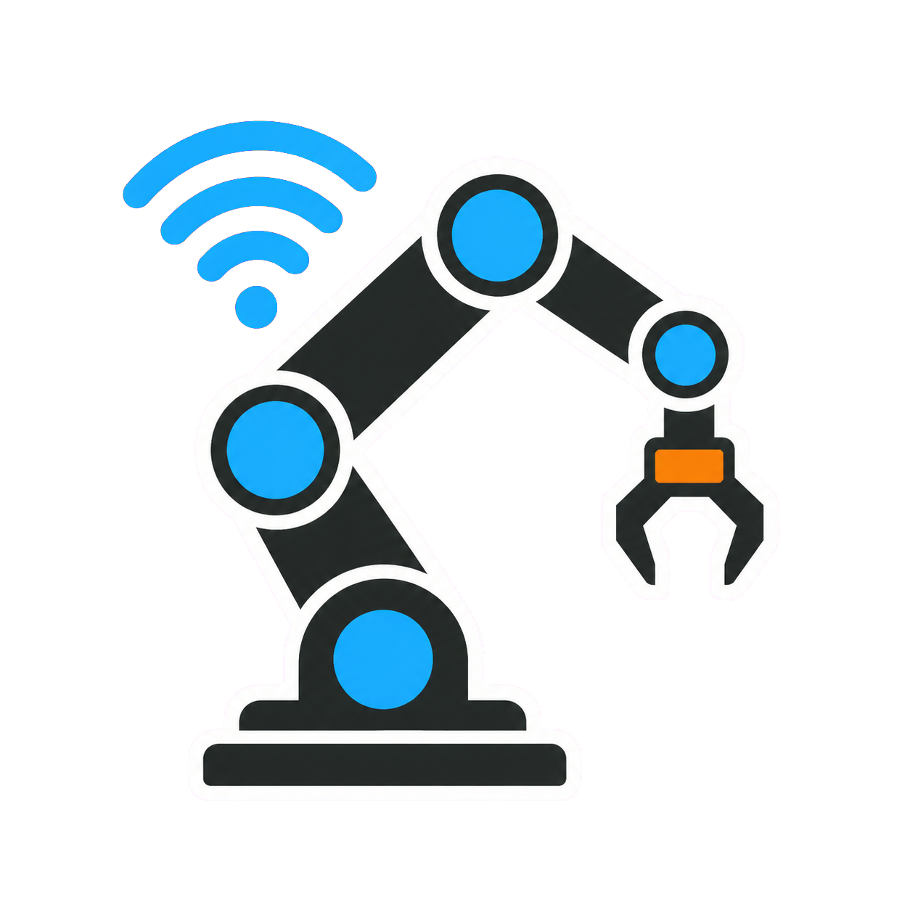
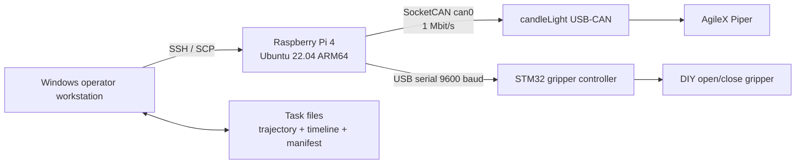

# Piper Automation Workbench

[中文文档](README.zh-CN.md) | English

A production-oriented teach-and-replay system for an AgileX Piper arm and a
custom STM32 gripper. A Windows workstation manages tasks over SSH while a
Raspberry Pi performs all real-time CAN and serial I/O.

<p align="center">
  
</p>

> This repository contains the automation software, configuration templates,
> and tests. Factory trajectories, calibration coordinates, logs, and device
> credentials are intentionally excluded.

## Highlights

- 200 Hz manual-teach trajectory acquisition with monotonic timestamps.
- Timestamp-driven joint replay through the official `piper_sdk` API.
- Pause-and-annotate workflow for two-state DIY gripper events.
- Continuous multi-slot execution without reopening CAN or serial devices.
- Per-layer, per-slot task manifests for 27-position trays.
- Program-defined all-zero Home and a reusable feeder-above anchor.
- Windows GUI for remote device checks, recording, validation, deployment,
  telemetry collection, and production execution.
- Raspberry Pi setup for SocketCAN at 1 Mbit/s and a stable gripper symlink.

## System Architecture



Windows never opens CAN or the gripper serial port. Hardware ownership remains
on the Raspberry Pi, which avoids USB pass-through instability and keeps each
production run under one controller process.

## Production Workflow

Each tray position is an independent task:

```text
teach/production_tasks/layer_01_slot_01/
├── task.json
├── trajectory.csv
├── trajectory.csv.timestamps.csv
└── gripper_timeline.json
```

The field workflow follows four explicit stages:

1. **A - Record:** drag-teach one complete arm path at 200 Hz. Press `H` to
   return to the shared feeder-above anchor and finish the file.
2. **B - Annotate:** replay the trajectory, pause at exact moments, and record
   gripper `close` / `open` events against trajectory time.
3. **C - Validate:** replay arm and gripper together at low speed.
4. **D - Save:** pull the verified task back to Windows and mark it ready.

Production mode preflights every task, moves to the feeder anchor once, opens
CAN and serial once, then streams adjacent tasks in sequence. Gripper events
are synchronized to actual trajectory progress rather than wall-clock launch
time.

## Quick Start

For a first installation or operator handoff, use the detailed field guides
instead of relying on the abbreviated commands below:

- [Zero-to-production handoff (Chinese)](docs/GETTING_STARTED.zh-CN.md)
- [AI-assisted same-Pi handoff (Chinese)](docs/AI_ASSISTED_HANDOVER.zh-CN.md)
- [Raspberry Pi network handoff (Chinese)](docs/NETWORK_HANDOVER.zh-CN.md)
- [Trajectory-only field runbook (Chinese)](docs/FIELD_RUNBOOK.zh-CN.md)
- [Troubleshooting (Chinese)](docs/TROUBLESHOOTING.zh-CN.md)

### 1. Raspberry Pi

Target: Raspberry Pi 4, Ubuntu 22.04 ARM64, Python 3.10.

```bash
git clone https://github.com/impa-Rosetta/piper-automation.git piper_robot_project
cd piper_robot_project
bash scripts/setup_raspberry_pi.sh
sudo systemctl start can0.service
```

The GitHub repository is named `piper-automation`, while the standardized
Raspberry Pi deployment directory is `/home/piper/piper_robot_project`.

Verify devices:

```bash
ip -details link show can0
ls -l /dev/piper_gripper
source ~/.venvs/piper_robot_project_api/bin/activate
python scripts/read_status.py --can-port can0
```

The recorder uses the API-enabled official SDK interface used by AgileX's
teach/replay example. The setup script checks out the compatible official SDK
branch explicitly. See [Deployment](docs/DEPLOYMENT.md) for compatibility
notes and manual setup.

### 2. Windows workstation

Requirements: Python 3.10+, Tkinter, and Windows OpenSSH Client.

1. Configure key-based SSH with the alias `piper-pi`.
2. Double-click `start_piper_windows_workbench.bat`.
3. Set the remote project path and click the device check.
4. When taking over an existing Pi, pull its site data before synchronizing code,
   then use the A/B/C/D workflow.

No Python robotics packages are required on Windows.

## Data Model

`trajectory.csv` is compatible with the official teach/replay row layout:

```text
delta_time_s,j1_rad,j2_rad,j3_rad,j4_rad,j5_rad,j6_rad[,gripper]
```

The precise recorder also emits an absolute/monotonic timestamp sidecar.
Gripper actions are stored independently:

```json
{
  "events": [
    {"time_s": 4.215, "action": "close"},
    {"time_s": 12.680, "action": "open"}
  ]
}
```

See [Data Format](docs/DATA_FORMAT.md) for timing and synchronization details.

## Engineering Decisions

- **Full trajectories over sparse waypoints:** repeated experiments showed
  that streamed taught paths preserved the safe approach geometry more
  reliably for this constrained workcell.
- **200 Hz recording:** matches the feedback loop used by the Piper SDK
  examples and preserves short transitions and dwell periods.
- **Separate gripper timeline:** the arm and custom gripper remain independent
  devices while their actions are reproducibly synchronized.
- **Persistent production stream:** removes process startup, serial handshake,
  and Home-return delays between neighboring tray slots.
- **Templates, not factory data:** physical coordinates are installation-specific
  and should never be treated as portable defaults.

## Testing

Offline tests do not require robot hardware:

```bash
python -m unittest discover -s tests -v
python -m compileall -q teach scripts gripper
```

Hardware validation must begin unloaded, at low speed, with a physical E-stop
within reach.

## Safety

This is research and integration software, not a safety-rated robot controller.
Software stop is not a substitute for a physical emergency stop, guarding,
risk assessment, payload verification, or operator training. Never run two
processes against the same CAN interface.

## Site-data handoff

Factory trajectories are intentionally excluded from GitHub. Before changing
operators or controllers, run `bash scripts/export_site_data.sh` on the Pi and
store the resulting archive on two independent internal media. Restore with
`scripts/restore_site_data.sh`, then repeat no-load low-speed validation.

## Project Scope

This repository deliberately focuses on the completed non-visual automation
pipeline. Camera experiments and model-based insertion research are maintained
separately so they cannot change a validated production path.

## Credits

Built on the official [AgileX Piper SDK](https://github.com/agilexrobotics/piper_sdk)
and informed by the Piper teach/replay examples in
[Agilex-College](https://github.com/agilexrobotics/Agilex-College).

## License

MIT. The AgileX SDK is a separate dependency governed by its own license.
