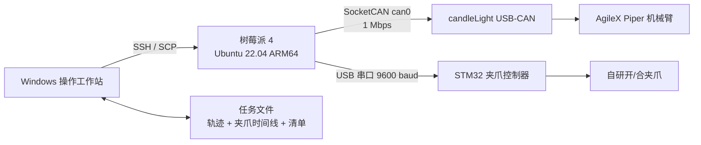

# Piper 自动化示教与生产工作台

中文 | [English](README.md)

这是一个面向真实工位的 AgileX Piper 机械臂自动化项目。系统将 Piper
机械臂与自研 STM32 二态夹爪组合起来，由 Windows 工作台负责操作、任务管理和
文件同步，由树莓派负责实时 CAN 与串口控制。

<p align="center">
  
</p>

> 本仓库只发布自动化软件、配置模板和测试。真实工厂轨迹、机械臂坐标、日志、
> 网络凭据和设备标定数据均被主动排除。

## 项目亮点

- 以单调时钟进行约 200 Hz 连续示教轨迹采集。
- 完全基于官方 `piper_sdk` 接口进行关节轨迹回放。
- 回放过程中暂停并标注夹爪开合时机，生成独立事件时间线。
- 连续生产时复用同一个 CAN 与串口连接，避免任务间反复初始化。
- 支持多层托盘，每层 27 个孔位分别录制、验证和管理。
- 支持六关节全零 Home 和公共“给料位置正上方”锚点。
- Windows 可视化工作台集成设备检查、录制、验证、同步、连续生产与遥测。
- 提供树莓派 SocketCAN 1 Mbps 自启动及 STM32 夹爪稳定设备名配置。

## 系统架构



Windows 不直接占用 CAN 或夹爪串口，所有硬件始终由树莓派控制。这种架构避免了
虚拟机 USB 透传不稳定，也保证连续生产过程只有一个控制进程持有设备。

## 现场工作流

每个孔位是一份独立任务：

```text
teach/production_tasks/layer_01_slot_01/
├── task.json                         # 参数和状态
├── trajectory.csv                    # 机械臂轨迹
├── trajectory.csv.timestamps.csv     # 详细时间戳
└── gripper_timeline.json              # 夹爪事件
```

现场采用清晰的 A/B/C/D 四阶段流程：

1. **A - 录制轨迹：** 在示教模式拖动机械臂完成整段安全路径，以 200 Hz 保存。
   按 `H` 可自动回到公共给料上方点并结束录制。
2. **B - 标注夹爪：** 回放机械臂轨迹，在准确时刻暂停并记录夹爪闭合/张开。
3. **C - 联合验证：** 低速联合回放机械臂和夹爪，确认抓取与放置时机。
4. **D - 保存任务：** 将树莓派现场文件拉回 Windows，检查完整性并标记已验证。

生产模式在运行前检查每个任务，只在开始时前往一次给料上方点，随后保持 CAN
和夹爪串口连接，连续流式执行相邻孔位。夹爪事件以机械臂实际轨迹进度为同步基准，
而不是简单按照程序启动后的墙上时钟触发。

## 快速开始

第一次接手项目请不要只执行下面的简版命令。完整的零基础交接、换热点、SSH、硬件接线、
轨迹恢复和验收步骤见：

- [从零部署与交接教程](docs/GETTING_STARTED.zh-CN.md)
- [树莓派换热点与网络交接](docs/NETWORK_HANDOVER.zh-CN.md)
- [纯轨迹方案现场操作手册](docs/FIELD_RUNBOOK.zh-CN.md)
- [现场故障排查](docs/TROUBLESHOOTING.zh-CN.md)

### 1. 树莓派部署

已验证目标环境：树莓派 4、Ubuntu 22.04 ARM64、Python 3.10。

```bash
git clone https://github.com/impa-Rosetta/piper-automation.git
cd piper-automation
bash scripts/setup_raspberry_pi.sh
sudo systemctl start can0.service
```

检查设备：

```bash
ip -details link show can0
ls -l /dev/piper_gripper
source ~/.venvs/piper_robot_project_api/bin/activate
python scripts/read_status.py --can-port can0
```

录制功能使用 AgileX 官方示教回放示例所需的 API-enabled SDK 接口，安装脚本会
显式检出兼容的官方 SDK 分支。版本兼容和手动部署方法见
[部署文档](docs/DEPLOYMENT.md)。

### 2. Windows 工作台

Windows 只需要 Python 3.10+、Tkinter 和系统 OpenSSH Client：

1. 配置免密 SSH，并建立别名 `piper-pi`。
2. 双击 `start_piper_windows_workbench.bat`。
3. 填写树莓派项目目录并执行“连接与设备检查”。
4. 在界面内同步程序，然后执行 A/B/C/D 录制验证流程。

Windows 不需要安装 Piper SDK，也不直接控制 CAN。

## 数据格式

`trajectory.csv` 延续官方示教示例的行格式：

```text
相邻帧时间差(s),J1(rad),J2(rad),J3(rad),J4(rad),J5(rad),J6(rad)[,gripper]
```

精准录制器还会生成绝对时间与单调时间的 sidecar 文件。夹爪动作单独保存：

```json
{
  "events": [
    {"time_s": 4.215, "action": "close"},
    {"time_s": 12.680, "action": "open"}
  ]
}
```

详见 [数据格式与同步](docs/DATA_FORMAT.md)。

## 关键工程决策

- **选择完整轨迹而不是少量离散点：** 实验中，完整轨迹更能稳定保留受限工位内的
  安全接近姿态和关节过渡，避免相邻离散点之间出现不可预期运动。
- **200 Hz 录制：** 对齐 Piper SDK 示例的反馈周期，能够保留短时过渡和停顿。
- **夹爪事件独立保存：** 机械臂与自研夹爪保持物理分体，同时实现可重复同步。
- **连续生产流：** 任务之间不重启进程、不重新打开串口、不反复回 Home，降低延迟
  和夹爪动作错位风险。
- **真实坐标不进入公共仓库：** 工位坐标具有设备唯一性，公开默认值反而不安全。

## 测试

不连接机械臂也可以运行离线测试：

```bash
python -m unittest discover -s tests -v
python -m compileall -q teach scripts gripper
```

实机验证必须从无负载、低速开始，并保证物理急停随时可用。

## 安全声明

本项目是科研与工程集成软件，不是安全等级控制器。软件停止不能替代物理急停、
安全围栏、风险评估、负载验证和操作员培训。同一时间禁止多个进程控制同一 CAN。

## 现场数据交接

真实轨迹不会进入公开仓库。离场或换机前在树莓派执行：

```bash
bash scripts/export_site_data.sh
```

把生成的压缩包和 SHA-256 文件保存到两个独立的内部介质。恢复使用
`scripts/restore_site_data.sh`，恢复后必须重新低速验证。

## 项目边界

本仓库专注已经成型的无视觉自动化生产链。相机定位和视觉插入实验被拆分为独立
项目，避免实验代码影响已经验证的生产路径。

## 致谢

项目基于官方 [AgileX Piper SDK](https://github.com/agilexrobotics/piper_sdk)，
并参考 [Agilex-College](https://github.com/agilexrobotics/Agilex-College)
中的 Piper 示教回放示例。

## 许可证

本项目采用 MIT License。AgileX SDK 是独立依赖，遵循其自身许可证。
