# Architecture / 架构说明

## Control boundary

The Windows workstation is a non-real-time orchestration layer. It creates task
manifests, opens interactive SSH terminals, synchronizes files, and displays
task state. It never imports `piper_sdk` and never opens CAN or the STM32 port.

Windows 工作台属于非实时编排层，只负责创建任务、打开交互式 SSH 终端、同步文件
和展示状态。它不导入 `piper_sdk`，也不直接打开 CAN 或 STM32 串口。

The Raspberry Pi is the device owner. `production_stream.py` keeps the Piper
interface and gripper serial connection alive across multiple tasks. This
removes process startup, USB enumeration, and serial startup delays from task
boundaries.

树莓派是唯一硬件控制端。`production_stream.py` 在多个任务之间持续持有 Piper 接口
和夹爪串口，消除任务边界上的进程启动、USB 枚举和串口握手延迟。

## Runtime layers

| Layer | Main modules | Responsibility |
| --- | --- | --- |
| Operator | `windows_remote_workbench.py` | Task lifecycle, SSH/SCP, status UI |
| Workflow | `run_task_sequence.py` | Preflight, ordering, manifests |
| Streaming | `production_stream.py` | Persistent multi-task execution |
| Replay | `play_trajectory_precise.py` | Monotonic scheduling, interpolation, tracking |
| Recording | `record_trajectory_precise.py` | 200 Hz teach feedback capture |
| End effector | `gripper_serial.py` | Persistent two-state STM32 protocol |
| Hardware API | official `piper_sdk` | CAN feedback and motion commands |

## Timing model

Trajectory rows store delta time. At load time they are converted to cumulative
trajectory time. Replay uses a monotonic clock and linear joint interpolation.
The default stream period is 5 ms. A gripper event becomes eligible only after
actual trajectory progress reaches its timestamp; an optional hold allows the
physical gripper to complete its action.

轨迹行保存相邻帧时间差，加载时转换为累计轨迹时间。回放使用单调时钟和关节线性插值，
默认发送周期为 5 ms。只有当机械臂实际轨迹进度到达事件时间戳后，夹爪事件才会触发；
可配置保持时间用于等待夹爪完成机械动作。

## Task lifecycle

```mermaid
stateDiagram-v2
    [*] --> Draft
    Draft --> Recorded: A / 200 Hz teach
    Recorded --> Annotated: B / gripper events
    Annotated --> Verified: C / linked low-speed test
    Verified --> Ready: D / pull and inspect
    Ready --> Running: continuous production
    Running --> Ready: task complete
    Running --> Fault: E-stop, CAN, tracking, serial
    Fault --> Draft: inspect and re-record
```

## Safety model

The software checks file completeness, task boundaries, feedback liveness,
tracking error, and device presence. These are process guards, not functional
safety. Physical emergency stop and cell guarding remain mandatory.

软件会检查文件完整性、任务衔接、反馈存活、跟踪误差和设备状态。这些属于流程保护，
不构成功能安全。物理急停和工位防护仍然是必须条件。
